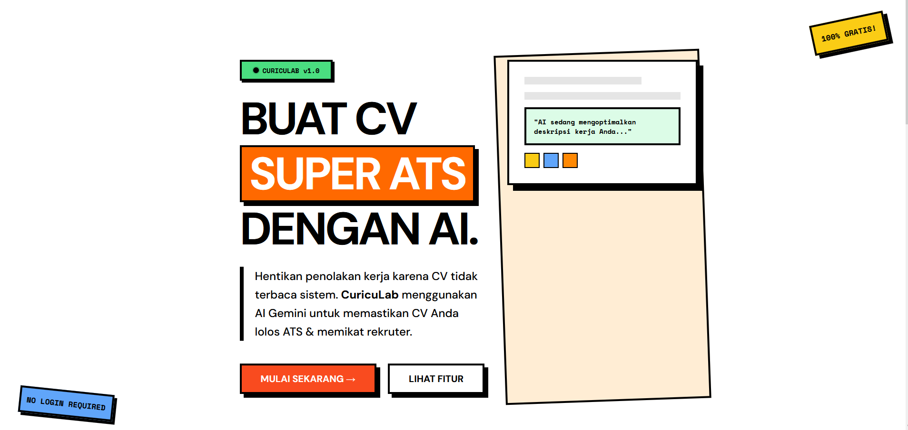

# Curriculab

**Curriculab** adalah aplikasi web **AI-powered CV builder** yang membantu pengguna membuat CV yang **kreatif namun tetap ATS-friendly**, sepenuhnya **gratis**, **tanpa login**, dan **tanpa penyimpanan data di server**.

Aplikasi ini dirancang dengan prinsip *privacy-first* dan memanfaatkan AI (Gemini) untuk meningkatkan kualitas konten CV secara profesional dan relevan dengan posisi yang dilamar.

---

## ✨ Key Features

* **AI-Powered Content Enhancement**
  Menulis ulang deskripsi pengalaman kerja agar lebih profesional dan ATS-friendly.

* **Creative + ATS-Friendly Templates**
  Desain modern dengan struktur satu kolom yang aman untuk Applicant Tracking System.

* **No Login, No Database**
  Seluruh data CV disimpan secara lokal di browser pengguna (LocalStorage / IndexedDB).

* **Export Ready-to-Use CV**
  Ekspor CV ke format **PDF** dan **DOCX**.

* **100% Free**
  Tidak ada paywall, tidak ada subscription, tidak ada biaya tersembunyi.

---

## 🎯 Target Users

* Fresh graduate
* Junior–mid level professional
* Pekerja kreatif (Designer, UI/UX, Developer)
* Pencari kerja yang melamar ke perusahaan dengan sistem ATS

---

## 🧠 How It Works

1. Pengguna mengisi data CV melalui form terstruktur
2. Pengguna memilih target role dan template
3. AI meningkatkan konten CV (summary, experience, skills)
4. Pengguna melakukan review dan editing
5. CV diekspor ke PDF atau DOCX

---

## 🏗️ Tech Stack

| Layer    | Technology                       |
| -------- | -------------------------------- |
| Frontend | Astro + Tailwind CSS             |
| Backend  | Cloudflare Workers               |
| AI       | Gemini API (Free Tier)           |
| Storage  | Browser LocalStorage / IndexedDB |
| Hosting  | Cloudflare Pages                 |

Semua teknologi yang digunakan memiliki **free tier** dan tidak memerlukan biaya operasional.

---

## 🗂️ Project Structure (High Level)

```
curriculab/
├─ apps/
│  ├─ web/            # Astro frontend
│  └─ worker/         # Cloudflare Worker (AI proxy)
├─ packages/
│  ├─ ui/             # Shared UI components
│  └─ core/           # CV data model & utilities
├─ docs/
└─ README.md
```

---

## 📦 Data Handling & Privacy

* Tidak ada data CV yang dikirim atau disimpan di server
* Backend hanya berfungsi sebagai **proxy AI** untuk menyembunyikan API key
* Semua data CV berada di sisi klien (browser pengguna)

---

## ⚠️ Limitations

* Tidak mendukung penyimpanan cloud atau akun pengguna
* Bergantung pada kuota gratis Gemini API
* CV tidak otomatis dikirim ke job portal

---

## 🚀 Roadmap

* [ ] Multi-language CV (ID / EN)
* [ ] Additional ATS-tested templates
* [ ] Role-based AI prompt presets
* [ ] Cover letter generator

---

## 🤝 Contributing

Kontribusi terbuka untuk siapa pun.

1. Fork repository
2. Buat branch fitur (`feature/nama-fitur`)
3. Commit perubahan
4. Ajukan Pull Request

---

## 📄 License

MIT License

---

## 📌 Disclaimer

Curriculab tidak menjamin CV akan diterima oleh perusahaan mana pun. Hasil akhir tetap bergantung pada kebijakan rekrutmen masing-masing perusahaan.

---

## 👤 Author

**Hamzan Dev**
Software Engineer

---

> Curriculab — Build your CV with clarity, creativity, and confidence.
