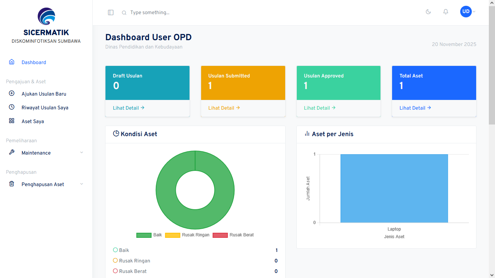

## 📋 Tentang Sistem

Sistem Clearance Belanja Aset TIK adalah aplikasi web yang dikembangkan untuk **Diskominfotiksandi Kabupaten Sumbawa** dalam mengelola siklus penuh IT Asset Management (ITAM) Lifecycle. Sistem ini mengintegrasikan proses clearance pra-pengadaan (Clearance I) dan pasca-pengadaan (Clearance II) dengan manajemen inventaris aset berbasis barcode.


### Latar Belakang

Dalam siklus pengelolaan aset TIK pemerintah, sering terjadi:
- Duplikasi pengadaan
- Spesifikasi tidak sesuai kebutuhan
- Lemahnya monitoring aset pasca-pengadaan

Untuk mengatasi hal ini, sistem clearance aset TIK diperlukan untuk memastikan setiap pengadaan terverifikasi dan setiap aset termonitor dari perencanaan hingga penghapusan.

### Objektif

- ✅ Mengembangkan sistem clearance aset TIK digital (Clearance I & II)
- ✅ Mengintegrasikan barcode asset tagging untuk identifikasi dan monitoring
- ✅ Menyediakan modul pemeliharaan dan penghapusan berbasis lifecycle management
- ✅ Menyediakan dashboard analytics dan reporting

## 🚀 Fitur Utama

### 1. **Clearance I (Pra-Pengadaan)**
- Pengajuan usulan pengadaan aset oleh OPD
- Verifikasi admin dengan deteksi duplikasi
- Validasi spesifikasi berdasarkan standar
- Penerbitan Form Clearance I dengan TTE (Tanda Tangan Elektronik)
- Prasyarat untuk input DPA (Dokumen Pelaksanaan Anggaran)

### 2. **Clearance II (Pasca-Pengadaan)**
- Verifikasi kesesuaian barang dengan usulan
- Generate barcode otomatis untuk setiap aset
- Penerbitan Form Clearance II dengan TTE
- Prasyarat untuk SPJ (Surat Pertanggungjawaban)

### 3. **Manajemen Inventaris Aset**
- Inventarisasi aset per OPD
- Barcode scanning untuk info aset lengkap
- Tracking kondisi aset (baik, rusak, maintenance)
- Monitoring umur dan masa pakai aset
- Transfer aset antar OPD

### 4. **Pemeliharaan Aset**
- Penjadwalan maintenance (preventif & korektif)
- Upload bukti pemeliharaan
- Riwayat kerusakan dan perbaikan
- Tracking biaya pemeliharaan

### 5. **Penghapusan Aset**
- Auto-detect aset rusak berat/umur > 5 tahun
- Usulan penghapusan oleh OPD
- Verifikasi admin
- Penerbitan surat rekomendasi dengan TTE

### 6. **Dashboard & Reporting**
- Dashboard role-based (Admin, Pimpinan, OPD)
- Statistik aset per OPD
- Status clearance real-time
- Grafik tren dengan Chart.js
- Laporan clearance, aset, dan pemeliharaan
- Export PDF/Excel

### 7. **Notifikasi & Logging**
- Real-time notification system
- Audit trail lengkap
- Activity logging
- Email notifications

## 🛠️ Tech Stack

### Backend
- **Framework**: Laravel 12.x
- **PHP**: 8.2+
- **Database**: PosgreSQL 6.0+
- **Authentication**: Laravel Jetstream + Fortify
- **PDF Generation**: DomPDF / mPDF
- **Barcode**: Picqer Barcode Generator

### Frontend
- **CSS Framework**: Bootstrap 4.6
- **Icons**: Feather Icons
- **Charts**: Chart.js 4.4.0
- **JavaScript**: Vanilla JS + jQuery
- **Template**: Custom Bootstrap Admin

### Additional Libraries
- Laravel Sanctum (API Authentication)
- Laravel Jetstream (User Management)
- SimpleSoftwareIO/simple-qrcode (QR Code)

## 👥 User Roles & Permissions

### 1. **Admin Kominfo**
- Verifikasi usulan pengadaan
- Menerbitkan Clearance I & II
- Verifikasi barang pasca-pengadaan
- Kelola inventaris aset
- Proses penghapusan aset
- Kelola master data (OPD, User, Spesifikasi)
- Akses semua laporan

### 2. **Pimpinan Diskominfotiksandi**
- Tanda tangan elektronik (TTE) Clearance I & II
- Tanda tangan surat rekomendasi penghapusan
- Dashboard monitoring
- Akses laporan dan analytics

### 3. **User OPD**
- Ajukan usulan pengadaan
- Download Form Clearance I & II
- Lihat inventaris aset OPD
- Ajukan pemeliharaan/perbaikan
- Ajukan usulan penghapusan
- Dashboard OPD

### 4. **BKAD/Bappeda (External Stakeholder)**
- Terima dokumen Clearance I untuk prasyarat DPA
- Terima dokumen Clearance II untuk prasyarat SPJ
- Validasi dokumen clearance (offline/manual)

## 🔄 Alur Proses Sistem

### Workflow Clearance I (Pra-DPA)
```
1. OPD mengajukan usulan pengadaan
   ↓
2. Admin verifikasi (cek duplikasi & spesifikasi)
   ↓
3. Admin approve/reject/request revision
   ↓
4. Pimpinan tanda tangan dengan TTE
   ↓
5. Sistem generate Form Clearance I
   ↓
6. OPD download & submit ke BKAD/Bappeda
   ↓
7. BKAD/Bappeda validasi untuk input DPA
```

### Workflow Clearance II (Pasca-DPA)
```
1. OPD serahkan barang hasil pengadaan
   ↓
2. Admin verifikasi kesesuaian barang
   ↓
3. Sistem generate barcode untuk setiap aset
   ↓
4. Pimpinan tanda tangan Clearance II dengan TTE
   ↓
5. Sistem generate Form Clearance II
   ↓
6. Aset masuk ke inventaris dengan barcode
   ↓
7. OPD download & submit ke BKAD/Bappeda untuk SPJ
```

### Lifecycle Management
```
Perencanaan → Clearance I → Pengadaan → Clearance II → 
Inventarisasi → Pemeliharaan → Penghapusan
```