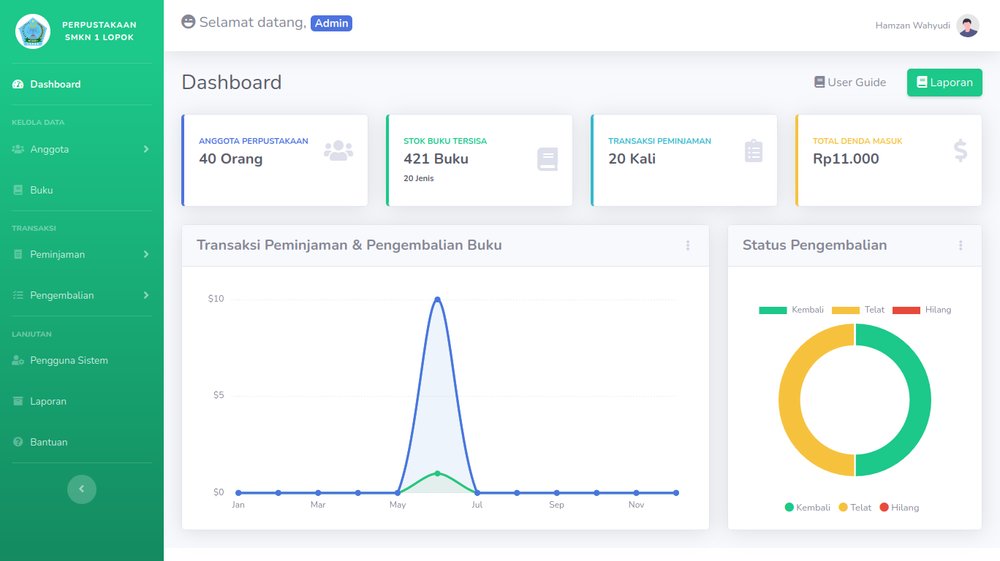

**Product Requirements Document (PRD)**

**Nama Aplikasi:** Sistem Informasi Perpustakaan Digital
**Versi:** 1.0
**Tanggal:** Juni 2025
**Disusun oleh:** Tim Pengembang

### 1. Latar Belakang

Aplikasi ini dibuat untuk mempermudah proses manajemen buku, peminjaman, dan pengembalian buku pada perpustakaan sekolah. Sistem ini menyediakan fitur untuk petugas perpustakaan dalam mengelola data anggota, buku, serta transaksi peminjaman dan pengembalian.

### 2. Tujuan

* Menyediakan sistem terintegrasi untuk manajemen perpustakaan.
* Memudahkan pelacakan stok buku dan riwayat peminjaman.
* Mengurangi risiko kehilangan data dan mempercepat proses operasional.

### 3. Fitur Utama

* Manajemen Buku (CRUD Buku dan Import CSV/Excel)
* Manajemen Anggota (Siswa & Non-Siswa)
* Transaksi Peminjaman Buku
* Transaksi Pengembalian Buku (status: kembali, telat, hilang)
* Statistik Dashboard (chart pinjaman dan pengembalian) berdasarkan role
* Autentikasi Petugas dengan Role-based Access
* Export Data ke Excel / PDF sebagai Laporan dalam rentang waktu tertentu

### 4. Aktor Sistem

* **Petugas**: Terdiri dari Admin dan Petugas biasa. Admin dapat mengelola seluruh data, dan Petugas biasa juga demikian (kecuali buat laporan dan kelola data petugas).
* **Siswa**

### 5. Alur Penggunaan

1. **Login Petugas**
2. **Kelola Data Buku dan Anggota**
3. **Melakukan Peminjaman Buku**
4. **Melakukan Pengembalian Buku**
5. **Mengakses Dashboard Statistik**

### 6. Teknologi

* Laravel 12
* MySQL
* Laravel Excel
* Chart.js
* Bootstrap

### 7. Validasi & Keamanan

* Validasi field pada saat input dan import
* Pembatasan akses berdasarkan role

### 8. Target Pengguna

* Operator Perpustakaan Sekolah
* Siswa/i SMK/MA/SMA

### 9. Batasan Sistem

* Sistem berbasis web, hanya dapat digunakan melalui browser.
* Tidak tersedia fitur pencarian buku.

### 10. Timeline Pengembangan

* Desain UI/UX: 1 minggu
* Pengembangan Backend: 2 minggu
* Testing & Debugging: 1 minggu
* Deployment & Dokumentasi: 1 minggu
