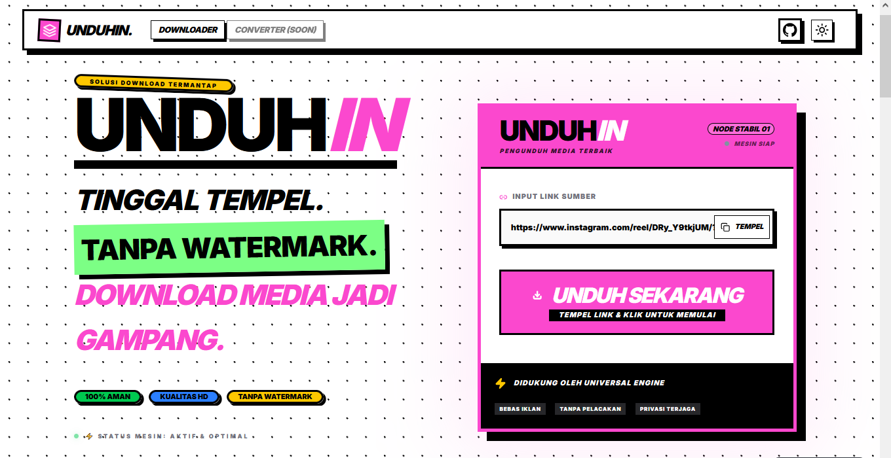

**Unduhin** adalah solusi pengunduh media universal yang modern, cepat, dan sepenuhnya gratis. Dibangun dengan estetika **Neobrutalism** yang tajam, aplikasi ini dirancang untuk memberikan pengalaman "Tinggal Tempel, Langsung Unduh" tanpa ribet dan tanpa watermark.

---

## ✨ Fitur Utama
- **Universal Downloader**: Dukungan untuk berbagai platform populer (YouTube, Instagram, TikTok, Facebook, Twitter/X, CapCut, dan lainnya).
- **Tanpa Watermark**: Unduh video TikTok dan Reels dengan kualitas asli tanpa logo yang mengganggu.
- **Premium UX**: Tampilan Neobrutalist yang responsif dengan dukungan Dark Mode penuh.
- **Media Preview**: Lihat pratinjau media (thumbnail) sebelum Anda memutuskan untuk mengunduhnya.
- **Fast & Lightweight**: Dibangun di atas Astro untuk performa maksimal dan loading secepat kilat.

## 🛡️ Keamanan & Privasi
Proyek ini mengutamakan keamanan user dan stabilitas sistem:
- **SSRF Protection**: Validasi URL yang ketat untuk mencegah serangan probe internal.
- **Rate-Limiting**: Batasan cerdas per IP untuk mencegah abuse dan botting.
- **Privacy First**: Tanpa pelacakan pengguna dan tanpa iklan yang mengganggu.

## 🛠️ Stack Teknologi
- **Framework**: [Astro](https://astro.build/) (Static Site Generator & SSR)
- **UI Library**: [React](https://reactjs.org/) + [shadcn/ui](https://ui.shadcn.com/)
- **Styling**: [Tailwind CSS](https://tailwindcss.com/)
- **Icons**: [Lucide React](https://lucide.dev/)
- **Animations**: [Framer Motion](https://www.framer.com/motion/)

---

## 🚀 Memulai (Local Setup)

Pastikan Anda memiliki **Node.js** dan **pnpm** terinstal di sistem Anda.

### Instalasi

1. Clone repositori ini:
   ```bash
   git clone https://github.com/void-panda/unduhin
   cd unduhin
   ```

2. Instal dependencies:
   ```bash
   pnpm install
   ```

3. Jalankan server development:
   ```bash
   pnpm dev
   ```

Buka browser Anda di [http://localhost:4321](http://localhost:4321) untuk melihat aplikasi berjalan.

## 📄 Lisensi

Proyek ini dilisensikan di bawah [MIT License](LICENSE).

---
**Unduhin — Solusi Gampang Unduh Media. Tinggal Tempel. Langsung Unduh.**
